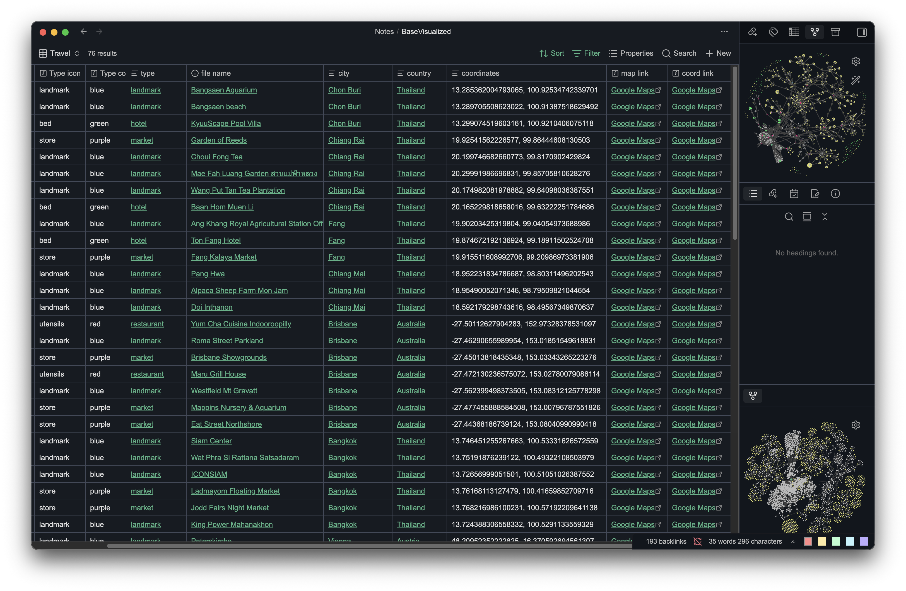
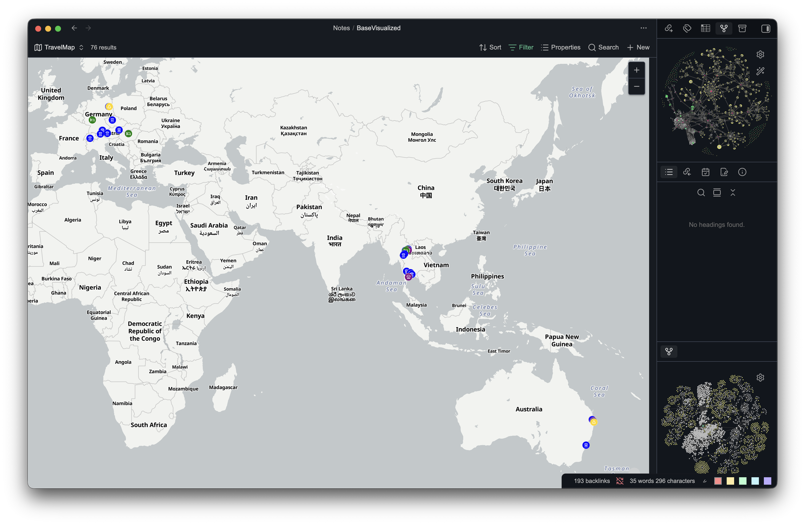
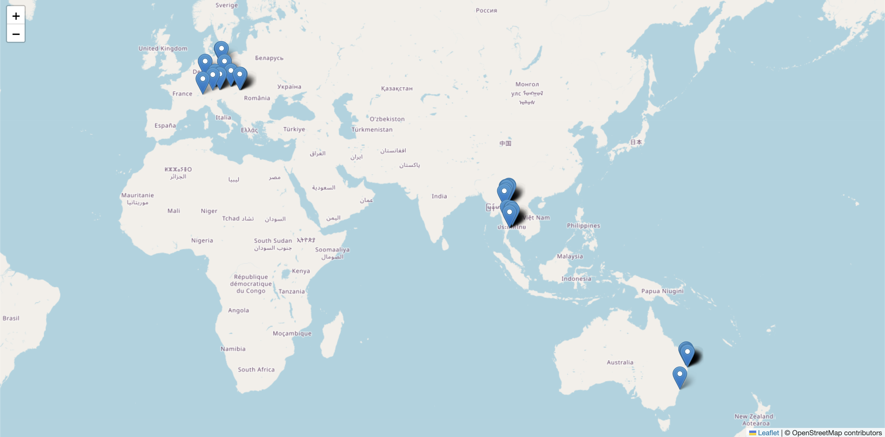

# About this Project
I aim to build a reflective and narrative photography gallery.
This idea stems from the journal records I kept whenever I went on traveling or any photography trips of mine which I never had a chance to share or profoundly present them.

I want to bring those photo to life by adding on whatever influenced that photography style (historical context or environmental factor that complement with certain composition) as well as including interesting facts and some geographical analysis for each location.

___
### Location Data
I took some time off to convert the location data of places I've been to into exact coordinates via Google Maps, and filled out the data into a .base file in Obsidian with appropriate information alongside it.

The data only cover the last 2 years since my memory is getting too fuzzy for more than that.

These data then can be plot using a "View" feature (the way Obsidian display .base's data in graphical format) using the "MapView"  plugin. I won't get too much into detail since only the raw data is needed for this website implementation, and the MapView is used only to get a rough understanding of the Leaflet look.

refer to more information here, if you're interested: https://obsidian.md/help/bases/views/map

And for the final step, since the Leaflet.js library uses the exact same format as Obsidian's MapView did, it's now only the matter of converting .csv (from .base) to a Javascript array and implement it using leaflet.js

___
### Location Analysis

# Reference

## Library and Syntax
stock images: https://www.google.com/
Leaflet Documents: https://leafletjs.com/  
Leaflet popups: https://leafletjs.com/index.html  
Declaring Map in Leaflet: https://leafletjs.com/reference.html#map-example
Flexbox: https://www.w3schools.com/css/css3_flexbox.asp
Loop in JS: https://www.w3schools.com/js/js_loops.asp

